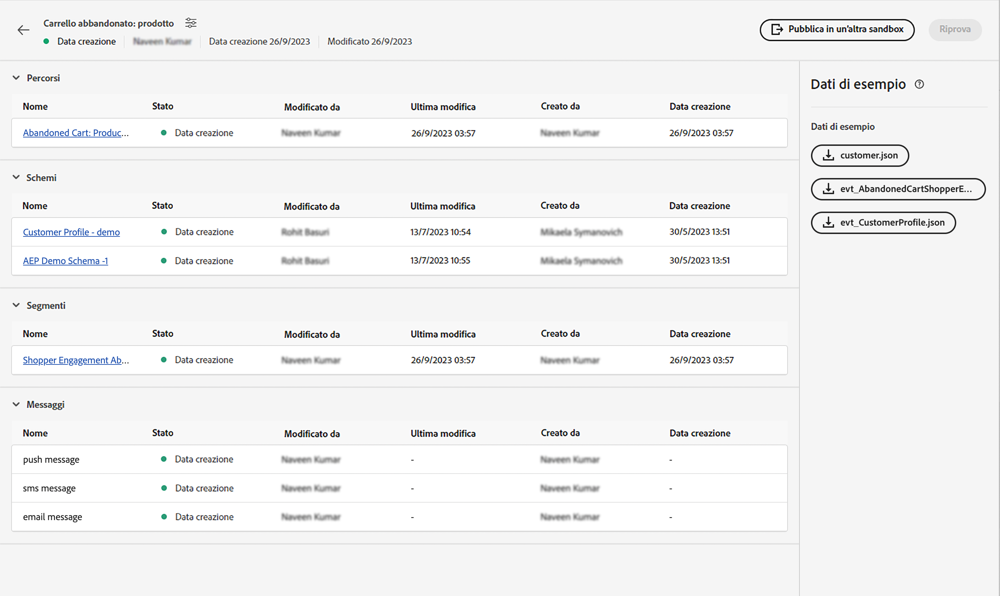
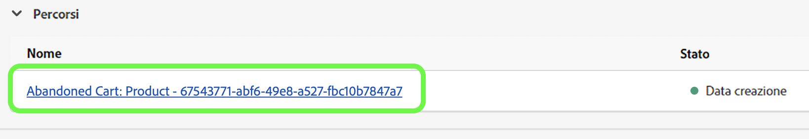
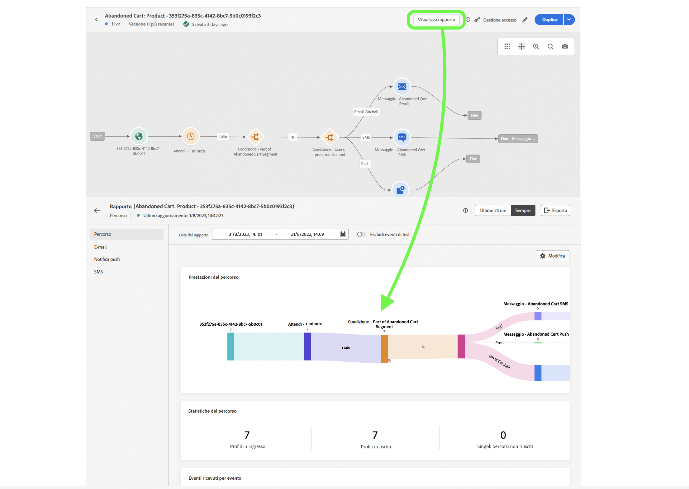

# Evento unitario

## Passaggi da seguire {#steps-to-follow}

>[!CONTEXTUALHELP]
>id="marketerexp_sampledata_unitaryevent"
>title="Modalità di utilizzo"
>abstract="Segui il collegamento per maggiori dettagli"

>[!IMPORTANT]
>
>Queste istruzioni potrebbero cambiare tra **[!UICONTROL playbook]** quindi fai sempre riferimento alla sezione dei dati di esempio del rispettivo **[!UICONTROL playbook]**.

## Prerequisito

* Utilizza il playbook per creare risorse di istanze come **[!UICONTROL Percorso]**, **[!UICONTROL Schemi]**, **[!UICONTROL Segmenti]**, **[!UICONTROL Messaggi]** e così via.

* Le risorse create verranno visualizzate nella pagina `Bill Of Material`

<!-- TODO: attached image needs to change once postman is removed from UI -->


>[!TIP]
>
>Se si utilizza un terminale per eseguire i cURL, è possibile impostare valori variabili prima di eseguire i cURL, in modo che non sia necessario sostituire tali valori nei singoli cURL.
>Ad esempio: se si imposta `ORG_ID=************@AdobeOrg`, la shell sostituirà automaticamente ogni occorrenza di `$ORG_ID` con il valore, in modo da poter copiare, incollare ed eseguire i cURL sottostanti senza alcuna modifica.
>
> In questo documento vengono utilizzate le seguenti variabili
>
> ACCESS_TOKEN
>
> API_KEY
>
> ORG_ID
>
> SANDBOX_NAME
>
> PROFILE_SCHEMA_REF
>
> PROFILE_DATASET_NAME
>
> PROFILE_DATASET_ID
>
> JOURNEY_ID
>
> PROFILE_BASE_CONNECTION_ID
>
> PROFILE_SOURCE_CONNECTION_ID
>
> PROFILE_TARGET_CONNECTION_ID
>
> PROFILE_INLET_URL
>
> CUSTOMER_MOBILE_NUMBER
>
> CUSTOMER_FIRST_NAME
>
> CUSTOMER_LAST_NAME
>
> EMAIL
>
> EVENT_SCHEMA_REF
>
> EVENT_DATASET_NAME
>
> EVENT_DATASET_ID
>
> EVENT_BASE_CONNECTION_ID
>
> EVENT_SOURCE_CONNECTION_ID
>
> EVENT_TARGET_CONNECTION_ID
>
> EVENT_INLET_URL
>
> TIMESTAMP
>
> UNIQUE_EVENT_ID

## Recupera il token IMS

1. Segui la documentazione dell’[autenticazione e accesso alle API di Experience Platform](https://experienceleague.adobe.com/docs/experience-platform/landing/platform-apis/api-authentication.html?lang=it) per generare il token di accesso.

## Pubblica il percorso creato dal playbook

Ci sono 2 modi per pubblicare il percorso; puoi sceglierne uno qualsiasi:

1. **Utilizzo dell’interfaccia utente AJO**: fai clic sul collegamento del percorso su `Bill Of Material Page`; questo ti reindirizzerà alla pagina del percorso in cui puoi fare clic sul pulsante **[!UICONTROL Pubblica]** per pubblicarlo.

   

1. **Utilizzo di cURL**

   1. Pubblica il percorso. La risposta conterrà l’ID di processo necessario nel passaggio successivo per recuperare lo stato di pubblicazione del percorso.

      ```bash
      curl --location --request POST "https://journey-private.adobe.io/authoring/jobs/journeyVersions/$JOURNEY_ID/deploy" \
      --header "Accept: */*" \
      --header "Authorization: Bearer $ACCESS_TOKEN" \
      --header "x-api-key: $API_KEY" \
      --header "x-gw-ims-org-id: $ORG_ID" \
      --header "x-sandbox-name: $SANDBOX_NAME" \
      --header "Content-Type: application/json" 
      ```

   1. La pubblicazione del percorso potrebbe richiedere del tempo; pertanto, per verificare lo stato, esegui il cURL sottostante fino a che `response.status` diventa `SUCCESS`. Se la pubblicazione del percorso richiede del tempo, attendi 10-15 secondi.

      ```bash
      curl --location "https://journey-private.adobe.io/authoring/jobs/$JOB_ID" \
      --header "Authorization: Bearer $ACCESS_TOKEN" \
      --header "x-api-key: $API_KEY" \
      --header "x-gw-ims-org-id: $ORG_ID" \
      --header "x-sandbox-name: $SANDBOX_NAME" \
      --header "Content-Type: application/json"
      ```

## Acquisisci il profilo cliente

>[!TIP]
>
>Se il provider di posta elettronica supporta le e-mail plus, puoi riutilizzare lo stesso indirizzo e-mail aggiungendo `+<variable>` alla fine dell’e-mail, ad es. `usertest@email.com` può essere riutilizzato come `usertest+v1@email.com` o `usertest+24jul@email.com`. Questo sarebbe utile per avere ogni volta un nuovo profilo, ma utilizzando sempre lo stesso ID e-mail.
>
>P.S.: le e-mail plus sono una funzione configurabile che deve essere supportata dal provider di posta elettronica. Controlla se sei in grado di ricevere e-mail su tali indirizzi prima di utilizzarli nel test.

1. L’utente che lo utilizza per la prima volta deve creare il file **[!DNL customer dataset]** e **[!DNL HTTP Streaming Inlet Connection]**.
1. Se hai già creato il **[!DNL customer dataset]** e **[!DNL HTTP Streaming Inlet Connection]**, vai al passaggio `5`.
1. Crea un set di dati del profilo cliente eseguendo il codice cURL seguente.

   ```bash
   curl --location "https://platform.adobe.io/data/foundation/catalog/dataSet" \
   --header "Authorization: Bearer $ACCESS_TOKEN" \
   --header "x-gw-ims-org-id: $ORG_ID" \
   --header "x-sandbox-name: $SANDBOX_NAME" \
   --header "x-api-key: $API_KEY" \
   --header "Content-Type: application/json" \
   --data '{
       "name": "'$PROFILE_DATASET_NAME'",
       "schemaRef": {
           "id": "'$PROFILE_SCHEMA_REF'",
           "contentType": "application/vnd.adobe.xed-full-notext+json; version=1"
       },
       "tags": {
           "unifiedProfile": [
           "enabled:true"
           ],
           "unifiedIdentity": [
           "enabled:true"
           ]
       },
       "fileDescription": {
           "persisted": true,
           "containerFormat": "parquet",
           "format": "parquet"
       }
   }'
   ```

   La risposta sarà nel formato `"@/dataSets/<PROFILE_DATASET_ID>"`.

1. Crea una **[!DNL HTTP Streaming Inlet Connection]** con l’aiuto dei seguenti passaggi.
   1. Crea una connessione di base.

      ```bash
      curl --location "https://platform.adobe.io/data/foundation/flowservice/connections?Cache-Control=no-cache" \
      --header "Authorization: Bearer $ACCESS_TOKEN" \
      --header "x-gw-ims-org-id: $ORG_ID" \
      --header "x-sandbox-name: $SANDBOX_NAME" \
      --header "x-api-key: $API_KEY" \
      --header "Content-Type: application/json" \
      --data '{
          "name": "AbandonedCartProduct_Base_ConnectionForCustomerProfile_1694458293",
          "description": "Marketer Playground Playbook-Validation Customer Profile Base Connection 1",
          "auth": {
              "specName": "Streaming Connection",
              "params": {
                  "dataType": "xdm"
              }
          },
          "connectionSpec": {
              "id": "bc7b00d6-623a-4dfc-9fdb-f1240aeadaeb",
              "version": "1.0"
          }
      }'
      ```

      Ottieni l’ID della connessione di base dalla risposta e utilizzalo al posto di `PROFILE_BASE_CONNECTION_ID` nei seguenti cURL

   1. Crea la connessione di origine.

      ```bash
      curl --location "https://platform.adobe.io/data/foundation/flowservice/sourceConnections" \
      --header "Authorization: Bearer $ACCESS_TOKEN" \
      --header "x-gw-ims-org-id: $ORG_ID" \
      --header "x-sandbox-name: $SANDBOX_NAME" \
      --header "Content-Type: application/json" \
      --header "x-api-key: $API_KEY" \
      --data '{
          "name": "AbandonedCartProduct_Source_ConnectionForCustomerProfile_1694458318",
          "description": "Marketer Playground Playbook-Validation Customer Profile Source Connection 1",
          "baseConnectionId": "'$PROFILE_BASE_CONNECTION_ID'",
          "connectionSpec": {
              "id": "bc7b00d6-623a-4dfc-9fdb-f1240aeadaeb",
              "version": "1.0"
          }
      }'
      ```

      Ottieni l’ID della connessione di origine dalla risposta e utilizzalo al posto di `PROFILE_SOURCE_CONNECTION_ID`

   1. Crea una connessione di destinazione.

      ```bash
      curl --location "https://platform.adobe.io/data/foundation/flowservice/targetConnections" \
      --header "Authorization: Bearer $ACCESS_TOKEN" \
      --header "x-gw-ims-org-id: $ORG_ID" \
      --header "x-sandbox-name: $SANDBOX_NAME" \
      --header "Content-Type: application/json" \
      --header "x-api-key: $API_KEY" \
      --data '{
          "name": "AbandonedCartProduct_Target_ConnectionForCustomerProfile_1694458407",
          "description": "Marketer Playground Playbook-Validation Customer Profile Target Connection 1",
          "data": {
              "format": "parquet_xdm",
              "schema": {
                  "version": "application/vnd.adobe.xed-full+json;version=1",
                  "id": "'$PROFILE_SCHEMA_REF'"
              },
              "properties": null
          },
          "connectionSpec": {
              "id": "c604ff05-7f1a-43c0-8e18-33bf874cb11c",
              "version": "1.0"
          },
          "params": {
              "dataSetId": "'$PROFILE_DATASET_ID'"
          }
      }'
      ```

      Ottieni l’ID della connessione di destinazione dalla risposta e utilizzalo al posto di `PROFILE_TARGET_CONNECTION_ID`

   1. Crea un flusso di dati.

      ```bash
      curl --location "https://platform.adobe.io/data/foundation/flowservice/flows" \
      --header "Authorization: Bearer $ACCESS_TOKEN" \
      --header "x-gw-ims-org-id: $ORG_ID" \
      --header "x-sandbox-name: $SANDBOX_NAME" \
      --header "Content-Type: application/json" \
      --header "x-api-key: $API_KEY" \
      --data '{
          "name": "AbandonedCartProduct_Dataflow_ForCustomerCustomerProfile_1694460528",
          "description": "Marketer Playground Playbook-Validation Customer Profile Dataflow 1",
          "flowSpec": {
              "id": "d8a6f005-7eaf-4153-983e-e8574508b877",
              "version": "1.0"
          },
          "sourceConnectionIds": [
              "'$PROFILE_SOURCE_CONNECTION_ID'"
          ],
          "targetConnectionIds": [
              "'$PROFILE_TARGET_CONNECTION_ID'"
          ]
      }'
      ```

   1. Ottieni la connessione di base. Il risultato conterrà inletUrl necessario per inviare i dati del profilo.

      ```bash
      curl --location "https://platform.adobe.io/data/foundation/flowservice/connections/$PROFILE_BASE_CONNECTION_ID" \
      --header "Authorization: Bearer $ACCESS_TOKEN" \
      --header "x-gw-ims-org-id: $ORG_ID" \
      --header "x-sandbox-name: $SANDBOX_NAME" \
      --header "Content-Type: application/json" \
      --header "x-api-key: $API_KEY"
      ```

      Ottieni inletUrl dalla risposta e utilizzalo al posto di `PROFILE_INLET_URL`

1. In questo passaggio l’utente deve avere i valori `PROFILE_DATASET_ID` e `PROFILE_INLET_URL`; in caso contrario, si rimanda al punto `3` o `4` rispettivamente.
1. Per acquisire il cliente, l’utente deve sostituire `CUSTOMER_MOBILE_NUMBER`, `CUSTOMER_FIRST_NAME`, `CUSTOMER_LAST_NAME` e `EMAIL` nei cURL seguenti.

   1. `CUSTOMER_MOBILE_NUMBER` corrisponde al numero di cellulare, ad esempio`+1 000-000-0000`
   1. `CUSTOMER_FIRST_NAME` corrisponde al nome dell’utente
   1. `CUSTOMER_LAST_NAME` corrisponde al cognome dell’utente
   1. `EMAIL` corrisponde all’indirizzo e-mail dell’utente, che è fondamentale per utilizzare un ID e-mail distinto in modo che possa essere importato un nuovo profilo.

1. Infine, esegui il cURL per acquisire il profilo cliente. Aggiorna `body.xdmEntity.consents.marketing.preferred` a `email`, `sms`, o `push` in base ai canali che intendi verificare. Imposta anche la corrispondenza tra `val` e `y`.

   ```bash
   curl --location "$PROFILE_INLET_URL?synchronousValidation=true" \
   --header 'Content-Type: application/json' \
   --data-raw '{
       "header": {
           "schemaRef": {
               "id": "'$PROFILE_SCHEMA_REF'",
               "contentType": "application/vnd.adobe.xed-full+json;version=1.0"
           },
           "imsOrgId": "'$ORG_ID'",
           "datasetId": "'$PROFILE_DATASET_ID'",
           "source": {
               "name": "Streaming dataflow - 1694460605"
           }
       },
       "body": {
           "xdmMeta": {
               "schemaRef": {
                   "id": "'$PROFILE_SCHEMA_REF'",
                   "contentType": "application/vnd.adobe.xed-full+json;version=1.0"
               }
           },
           "xdmEntity": {
           "consents": {
               "marketing": {
                   "preferred": "email",
                   "email": {
                       "val": "y"
                   },
                   "push": {
                       "val": "n"
                   },
                   "sms": {
                       "val": "n"
                   }
               }
           },
           "mobilePhone": {
               "number": "'$CUSTOMER_MOBILE_NUMBER'",
               "status": "active"
           },
           "person": {
               "name": {
               "firstName": "'$CUSTOMER_FIRST_NAME'",
               "lastName": "'$CUSTOMER_LAST_NAME'"
               }
           },
           "personalEmail": {
               "address": "'$EMAIL'"
           },
           "testProfile": false
           }
       }
   }'
   ```

## Acquisisci l’evento di attivazione del percorso

1. L’utente che lo utilizza per la prima volta deve creare **[!DNL event dataset]** e **[!DNL HTTP Streaming Inlet Connection for events]**
1. Se hai già creato **[!DNL event dataset]** e **[!DNL HTTP Streaming Inlet Connection for events]**, vai al passaggio `5`.
1. Crea un set di dati evento eseguendo il codice cURL seguente.

   ```bash
   curl --location "https://platform.adobe.io/data/foundation/catalog/dataSet" \
   --header "Authorization: Bearer $ACCESS_TOKEN" \
   --header "x-gw-ims-org-id: $ORG_ID" \
   --header "x-sandbox-name: $SANDBOX_NAME" \
   --header "x-api-key: $API_KEY" \
   --header "Content-Type: application/json" \
   --data '{
       "name": "'$EVENT_DATASET_NAME'",
       "schemaRef": {
           "id": "'$EVENT_SCHEMA_REF'",
           "contentType": "application/vnd.adobe.xed-full-notext+json; version=1"
       },
       "tags": {
           "unifiedProfile": [
               "enabled:true"
           ],
           "unifiedIdentity": [
               "enabled:true"
           ]
       },
       "fileDescription": {
           "persisted": true,
           "containerFormat": "parquet",
           "format": "parquet"
       }
   }'
   ```

   La risposta sarà nel formato `"@/dataSets/<EVENT_DATASET_ID>"`

1. Crea **[!DNL HTTP Streaming Inlet Connection for events]** con l’aiuto dei seguenti passaggi.
   <!-- TODO: Is the name unique? If so, we may need to generate and provide in variables.txt-->
   1. Crea una connessione di base.

      ```bash
      curl --location "https://platform.adobe.io/data/foundation/flowservice/connections?Cache-Control=no-cache" \
      --header "Authorization: Bearer $ACCESS_TOKEN" \
      --header "x-gw-ims-org-id: $ORG_ID" \
      --header "x-sandbox-name: $SANDBOX_NAME" \
      --header "x-api-key: $API_KEY" \
      --header "Content-Type: application/json" \
      --data '{
          "name": "AbandonedCartProduct_Base_ConnectionForAEPDemoSchema_1694461448",
          "description": "Marketer Playground Playbook-Validation AEP Demo Schema Base Connection 1",
          "auth": {
              "specName": "Streaming Connection",
              "params": {
                  "dataType": "xdm"
              }
          },
          "connectionSpec": {
              "id": "bc7b00d6-623a-4dfc-9fdb-f1240aeadaeb",
              "version": "1.0"
          }
      }'
      ```

      Ottieni l’ID della connessione di base dalla risposta e utilizzalo al posto di `EVENT_BASE_CONNECTION_ID`

   1. Crea la connessione di origine.

      ```bash
      curl --location "https://platform.adobe.io/data/foundation/flowservice/sourceConnections" \
      --header "Authorization: Bearer $ACCESS_TOKEN" \
      --header "x-gw-ims-org-id: $ORG_ID" \
      --header "x-sandbox-name: $SANDBOX_NAME" \
      --header "x-api-key: $API_KEY" \
      --header "Content-Type: application/json" \
      --data '{
          "name": "AbandonedCartProduct_Source_ConnectionForAEPDemoSchema_1694461464",
          "description": "Marketer Playground Playbook-Validation AEP Demo Schema Source Connection 1",
          "baseConnectionId": "'$EVENT_BASE_CONNECTION_ID'",
          "connectionSpec": {
              "id": "bc7b00d6-623a-4dfc-9fdb-f1240aeadaeb",
              "version": "1.0"
          }
      }'
      ```

      Ottieni l’ID della connessione di origine dalla risposta e utilizzalo al posto di `EVENT_SOURCE_CONNECTION_ID`

   1. Crea una connessione di destinazione.

      ```bash
      curl --location "https://platform.adobe.io/data/foundation/flowservice/sourceConnections" \
      --header "Authorization: Bearer $ACCESS_TOKEN" \
      --header "x-gw-ims-org-id: $ORG_ID" \
      --header "x-sandbox-name: $SANDBOX_NAME" \
      --header "x-api-key: $API_KEY" \
      --header "Content-Type: application/json" \
      --data '{
          "name": "AbandonedCartProduct_Target_ConnectionForAEPDemoSchema_1694802667",
          "description": "Marketer Playground Playbook-Validation AEP Demo Schema Target Connection 1",
          "data": {
              "format": "parquet_xdm",
              "schema": {
                  "version": "application/vnd.adobe.xed-full+json;version=1",
                  "id": "'$EVENT_SCHEMA_REF'"
              },
              "properties": null
          },
          "connectionSpec": {
              "id": "c604ff05-7f1a-43c0-8e18-33bf874cb11c",
              "version": "1.0"
          },
          "params": {
              "dataSetId": "'$EVENT_DATASET_ID'"
          }
      }'
      ```

      Ottieni l’ID della connessione di destinazione dalla risposta e utilizzalo al posto di `EVENT_TARGET_CONNECTION_ID`

   1. Crea un flusso di dati.

      ```bash
      curl --location "https://platform.adobe.io/data/foundation/flowservice/flows" \
      --header "Authorization: Bearer $ACCESS_TOKEN" \
      --header "x-gw-ims-org-id: $ORG_ID" \
      --header "x-sandbox-name: $SANDBOX_NAME" \
      --header "x-api-key: $API_KEY" \
      --header "Content-Type: application/json" \
      --data '{
          "name": "AbandonedCartProduct_Dataflow_ForCustomerAEPDemoSchema_1694461564",
          "description": "Marketer Playground Playbook-Validation AEP Demo Schema Dataflow 1",
          "flowSpec": {
              "id": "d8a6f005-7eaf-4153-983e-e8574508b877",
              "version": "1.0"
          },
          "sourceConnectionIds": [
              "'$EVENT_SOURCE_CONNECTION_ID'"
          ],
          "targetConnectionIds": [
              "'$EVENT_TARGET_CONNECTION_ID'"
          ]
      }'
      ```

   1. Ottieni la connessione di base. Il risultato conterrà inletUrl necessario per inviare i dati del profilo.

   ```bash
   curl --location "https://platform.adobe.io/data/foundation/flowservice/connections/$EVENT_BASE_CONNECTION_ID" \
       --header "Authorization: Bearer $ACCESS_TOKEN" \
       --header "x-gw-ims-org-id: $ORG_ID" \
       --header "x-sandbox-name: $SANDBOX_NAME" \
       --header "x-api-key: $API_KEY" \
       --header "Content-Type: application/json" 
   ```

   Ottieni inletUrl dalla risposta e utilizzalo al posto di `EVENT_INLET_URL`

1. In questo passaggio l’utente deve avere i valori `EVENT_DATASET_ID` e `EVENT_INLET_URL`; in caso contrario, si rimanda al punto `3` o `4` rispettivamente.
1. Per acquisire un evento, l’utente deve modificare la variabile temporale `TIMESTAMP` nel corpo della richiesta di cURL seguente.

   1. Sostituisci `body.xdmEntity` con il codice json scaricato per l’evento.
   1. Se `TIMESTAMP` corrisponde all’ora in cui si è verificato l’evento, utilizza il timestamp nel fuso orario UTC, ad esempio `2023-09-05T23:57:00.071+00:00`.
   1. Imposta un valore univoco per la variabile `UNIQUE_EVENT_ID`.

   ```bash
   curl --location "$EVENT_INLET_URL?synchronousValidation=true" \
   --header 'Content-Type: application/json' \
   --data-raw '{
       "header": {
           "schemaRef": {
               "id": "'$EVENT_SCHEMA_REF'",
               "contentType": "application/vnd.adobe.xed-full+json;version=1.0"
           },
           "imsOrgId": "'$ORG_ID'",
           "datasetId": "'$EVENT_DATASET_ID'",
           "source": {
               "name": "Streaming dataflow - 8/31/2023 9:04:25 PM"
           }
       },
       "body": {
           "xdmMeta": {
               "schemaRef": {
                   "id": "'$EVENT_SCHEMA_REF'",
                   "contentType": "application/vnd.adobe.xed-full+json;version=1.0"
               }
           },
           "xdmEntity": {
               "endUserIDs": {
                   "_experience": {
                       "aaid": {
                           "id": "'$EMAIL'"
                       },
                       "emailid": {
                           "id": "'$EMAIL'"
                       }
                   }
               },
               "_experience": {
                   "analytics": {
                       "customDimensions": {
                           "eVars": {
                           "eVar235": "AC11147"
                           }
                       }
                   }
               },
               "_id": "'$UNIQUE_EVENT_ID'",
               "commerce": {
                   "productListAdds": {
                       "value": 11498
                   }
               },
               "eventType": "commerce.productListAdds",
               "productListItems": [
                   {
                       "_id": "ACS1620",
                       "SKU": "P1",
                       "_experience": {
                           "analytics": {
                           "customDimensions": {
                               "eVars": {
                                   "eVar1": "Pants"
                               }
                           }
                           }
                       },
                       "currencyCode": "USD",
                       "name": "Sample value",
                       "priceTotal": 30841.13,
                       "product": "https://ns.adobe.com/xdm/common/uri",
                       "productAddMethod": "Sample value",
                       "quantity": 1
                   },
                   {
                       "_id": "ACS1729",
                       "SKU": "P2",
                       "_experience": {
                           "analytics": {
                               "customDimensions": {
                                   "eVars": {
                                       "eVar1": "Galliano"
                                   }
                               }
                           }
                       },
                       "currencyCode": "USD",
                       "name": "Sample value",
                       "priceTotal": 20841.13,
                       "product": "https://ns.adobe.com/xdm/common/uri",
                       "productAddMethod": "Sample value",
                       "quantity": 2
                   }
               ],
               "timestamp": "'$TIMESTAMP'",
               "web": {
                   "webInteraction": {
                       "URL": "https://experienceleague.adobe.com/docs/experience-platform/edge/data-collection/collect-commerce-data.html?lang=it",
                       "name": "Sample value",
                       "region": "Sample value"
                   },
                   "webPageDetails": {
                       "URL": "https://experienceleague.adobe.com/docs/experience-platform/edge/data-collection/collect-commerce-data.html?lang=it",
                       "isErrorPage": false,
                       "isHomePage": false,
                       "name": "Sample value",
                       "pageViews": {
                           "id": "Sample value",
                           "value": 1
                       },
                       "server": "Sample value",
                       "siteSection": "Sample value",
                       "viewName": "Sample value"
                   },
                   "webReferrer": {
                   "URL": "Sample value",
                   "type": "internal"
                   }
               }
           }
       }
   }'
   ```

## Convalida finale

Devi ricevere un messaggio sul canale preferito selezionato utilizzato nel passaggio **[!DNL Ingest the Customer Profile]** `8`

* `SMS` se il canale preferito è `sms` su `customer_country_code` e `customer_mobile_no`
* `Email` se il canale preferito è `email` su `email`

In alternativa, puoi verificare il `Journey Report`. Per farlo, fai clic su `Journey Object` su `Bill of Materials page` e verrai reindirizzato a `Journey Details page`.

Per ogni percorso pubblicato l’utente deve ottenere un pulsante **[!UICONTROL Visualizza rapporto]**



## Pulizia

Non avere più istanze di `Journey` in esecuzione contemporaneamente. Una volta completata la convalida, interrompi il percorso se è solo per la convalida.
